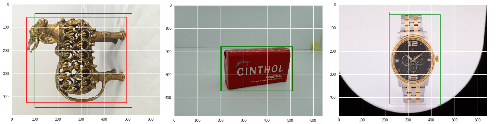

# Fipkart GRID 19

### Problem Statement:
The aim of the problem is to develop a Regression model to accurately find the coordinates of the best fitting rectangular Bounding Box around an Object in an image. Each image consists of only a single object and the x,y coordinates of the top left and bottom right corners of the Bounding Box is to be determined. The results would be evaluated on the basis of Intersection over Union (IoU) performance metric.

  

### Dataset Description
The Training set consists of around 14,000 images in Round 2 (+ 14,000 more in Round 3) and all of them are based on Product images that one would find on the Flipkart website. We are required to build a model on the given dataset and predict for a Test dataset and submit the results. Below are some of the Images provided along with their Bounding Boxes (Green).

  

### Built With

* [Python 3.6](https://www.python.org/) - The programming language used.
* [Jupyter Notebook](https://jupyter.org/) - Integrated Development Environment used.
* [opencv](https://opencv.org/) - Library to load training/test image data into numpy arrays and also perform Image manipulation.
* [matplotlib](https://matplotlib.org/) - Library to create Visualizations to analyse the data.
* [numpy](https://numpy.org/) - Library used to perform a wide range of Mathematical operations.
* [tensorflow](https://www.tensorflow.org/) - Library used to build and train the framework of Neural Networks.
* [scikit-learn](https://scikit-learn.org/stable/) - Library used to build and train the framework of the overall predictive model.
* [pickle](https://docs.python.org/3/library/pickle.html) - Library used to save the trained model for reusing purposes.

### Getting Started
* Step - 1 : Features Engineering
  * The two pairs of x,y coordinates of the diagonally opposite corners are converted to a pair of x,y coordinates of the center of Bounding Box and another pair of w,h values representing the Width and Height of the Bounding Box.
  * In this way it is more intuitive as characteristics of any Bounding Box and in the hope that model should be able to predict this more accurately.

* Step - 2 : Building the Neural Network
  * Several Neural Networks such as ResNet, MobileNet, Google's InceptionNet of varying depths were tried.
  * Settled with a custom modification of Inception architecture wherein the center coordinates of the Bounding Box are predicted somewhere in the middle of the architecture and the Width and Height are predicted in the Final Layer.
  * This was because it was found that predicting Center coordinates were an easier task to the Neural Networks than to accurately predict the Height and Width. So Width and Height are predicted at a later stage where there will be enough room for the model to tune its weights on.
 
* Step - 3 : 
  * The predictions are made on the Test dataset and are converted back to the original format of coordinates for Submission.
  * By the end of the Competition we were able to achieve an IoU score of 87.88%.

* Results and further Scope
  * Rigorous Feature Engineering on the Images could be performed such as warping, tilting, colour shifting, etc. that we were unable to perform due to time constraints.
  * Several Neural Networks could be designed and trained simulataneously wherein we could Ensemble all of them at the end to provide stable predictions and reduce any inherent bias in some of the networks.
  
Finally, our model was able to achieve the following results. Below are a few images with the True Bounding Box (Red) and the Predicted Bounding Box (Green).

  

  
### Relevant Files
[Training the Model - Jupyter Notebook](Train.ipynb)

[Prediction/Testing of Model - Jupyter Notebook](Predict.ipynb)
